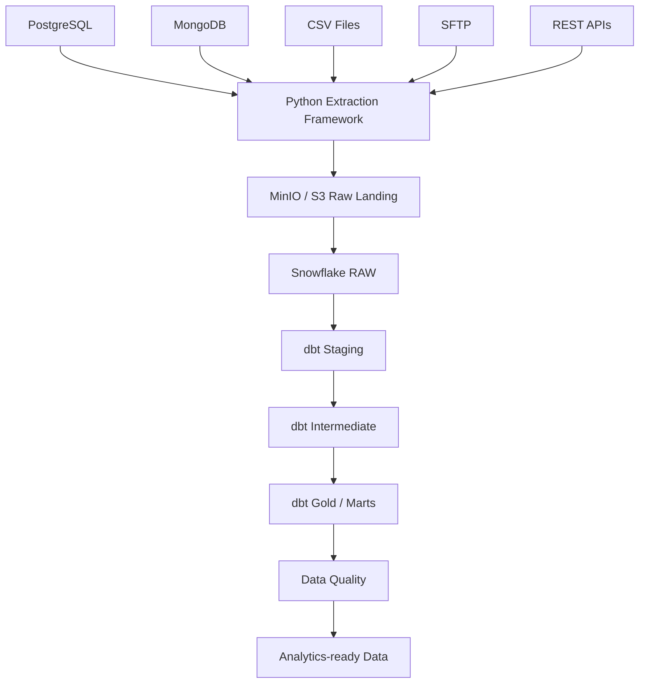

# Retail Data Platform - Data Engineering Pipeline

End-to-end data engineering pipeline demonstrating multi-source data ingestion,
raw data landing, Snowflake loading, dbt transformations, data quality checks,
and Airflow orchestration.

## Architecture

## Technologies

* Python
* PostgreSQL
* MongoDB
* Docker
* MinIO
* Snowflake
* dbt
* Great Expectations
* Apache Airflow
* Git / GitHub
